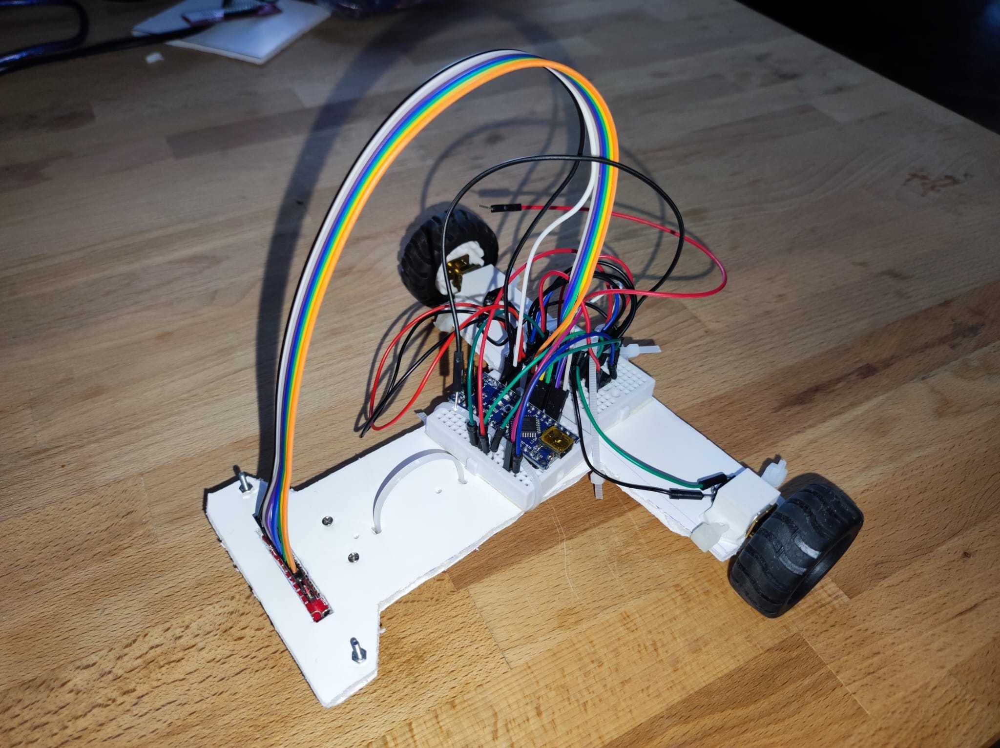

# Arduino Line Follower

### Description
This repository is dedicated to the line follower project for the Introduction to Robotics course, taken in the 3rd year (2023-2024) at the Faculty of Mathematics and Informatics, University of Bucharest.

Team members:
- [Cîlțea Ioana Dora Ștefania](https://github.com/CilteaIoana)
- [Oancea Antonia](https://github.com/AntoniaOancea)
- [Gheorghe Robert-Mihai](https://github.com/surtexx)

### Components
- Arduino Mini
- Zip-ties
- Power source - 7.4V LiPo battery
- Wheels
- QTR-8A reflectance sensor, along with screws
- Ball caster
- Chassis (manually made)
- Small breadboard
- L293D motor driver
- DC motors
- Wires

### Task
The task of the project was to develop a line follower robot. For the QTR-8A sensor, the calibration was required either automatically, or no calibration at all. The robot had to be able to follow a complex circuit, and for the maximum grade, it had to complete the whole track in maximum 20s.

Our robot managed to get the maximum grade, and it was able to complete the track in 16s.

### Implementation details
The algorithm used for line following is the one using a PID controller. The PID controller was implemented in order to reduce the oscillations of the robot, and to make it follow the line more precisely. The optimal values for the PID controller (on our chassis) were:
- K~p~ = 30
- K~i~ = 0.08
- K~d~ = 150

### Setup

### [Demo](https://www.youtube.com/watch?v=uUaTWENzHKA)

### [Source code](./line_follower.ino)